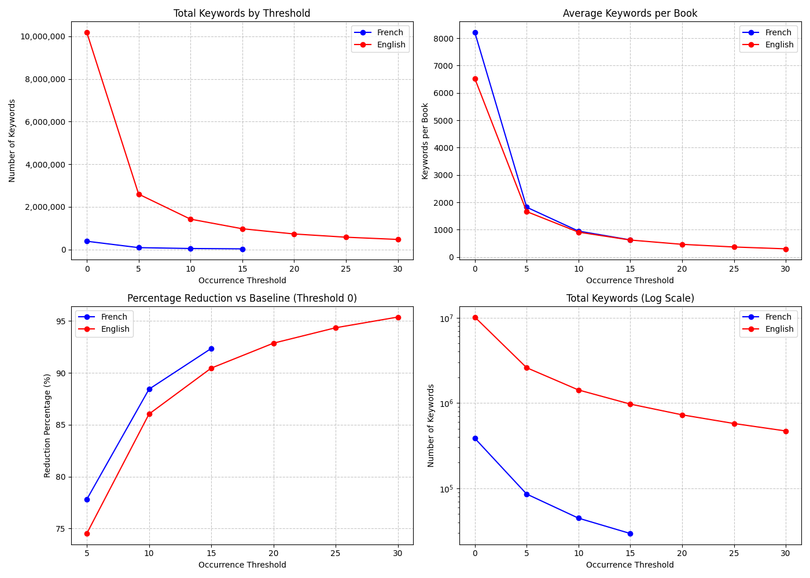
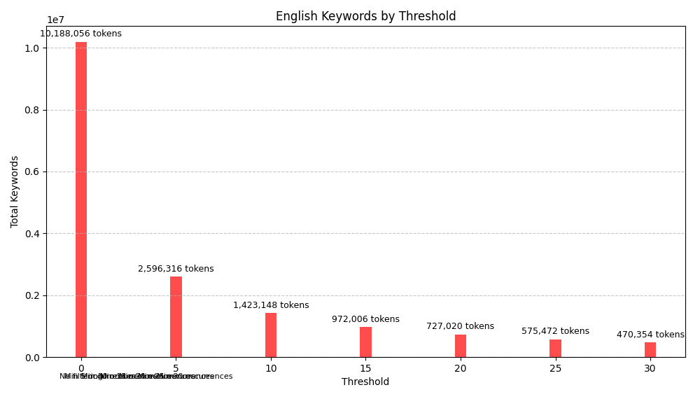
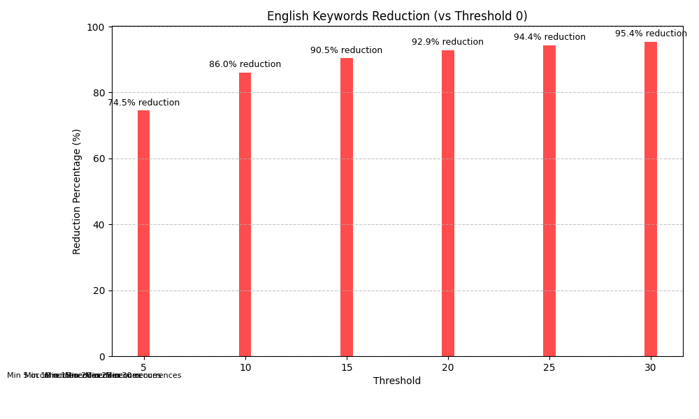
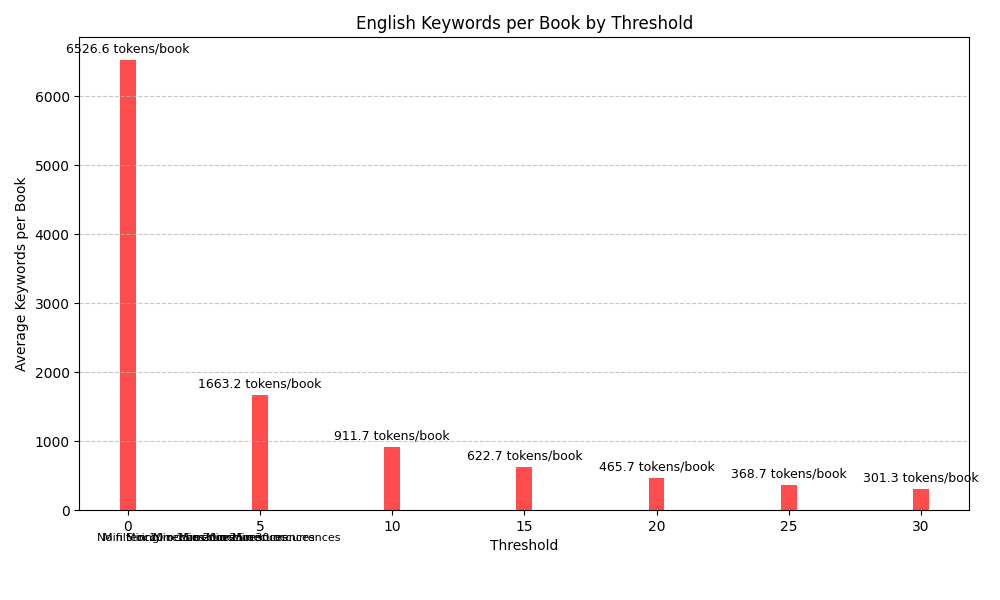
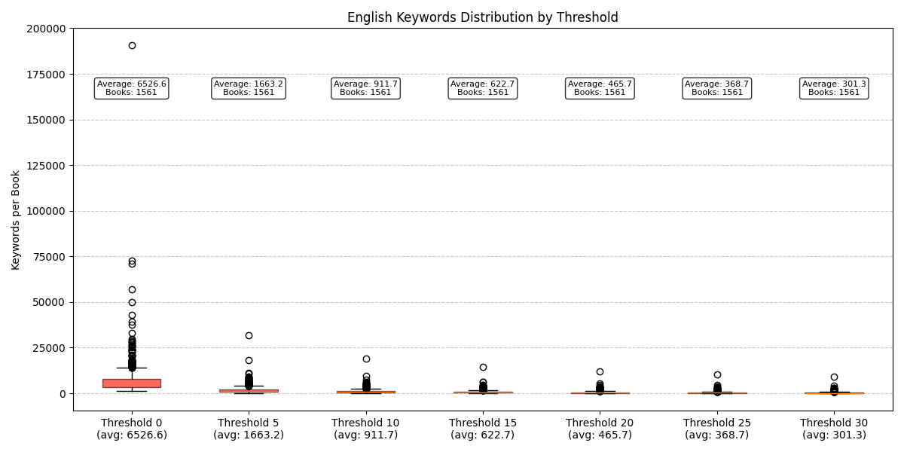
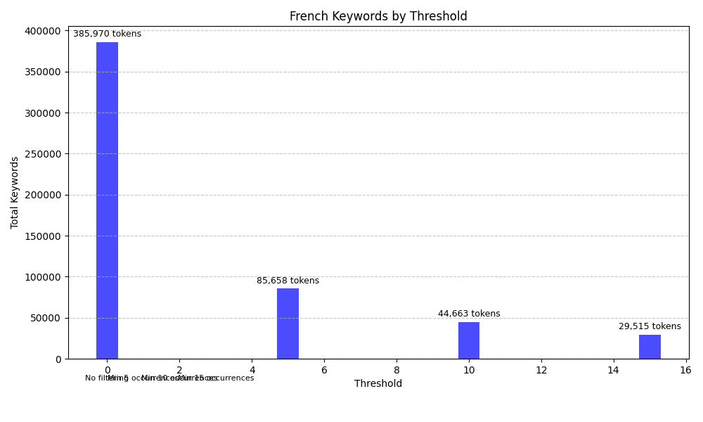
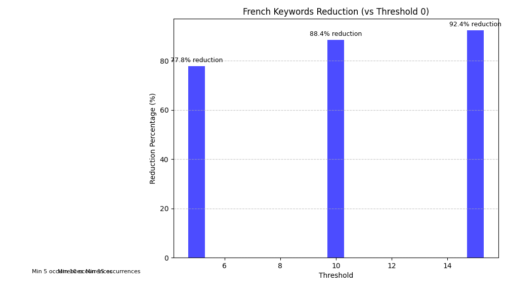
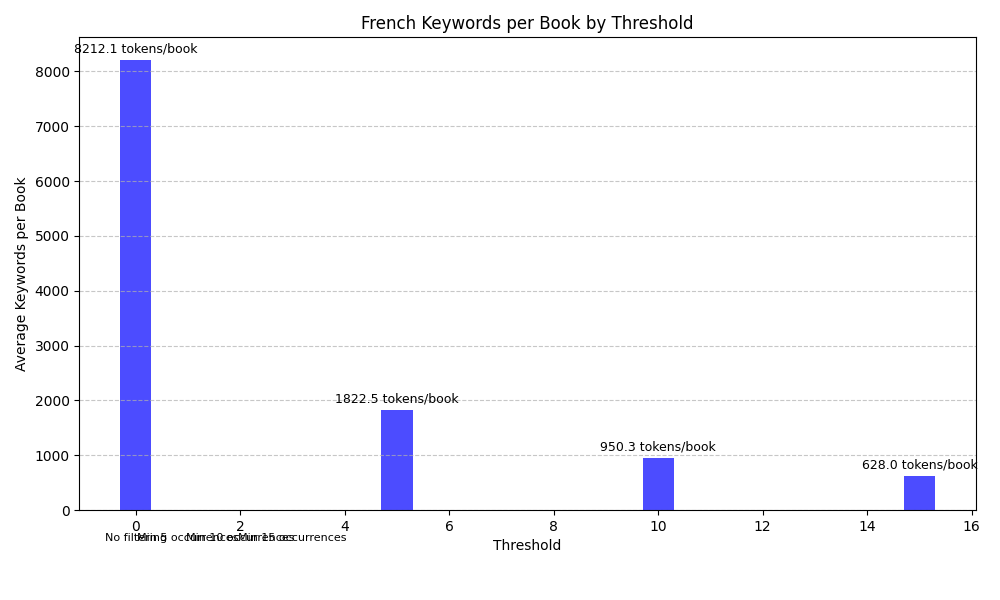
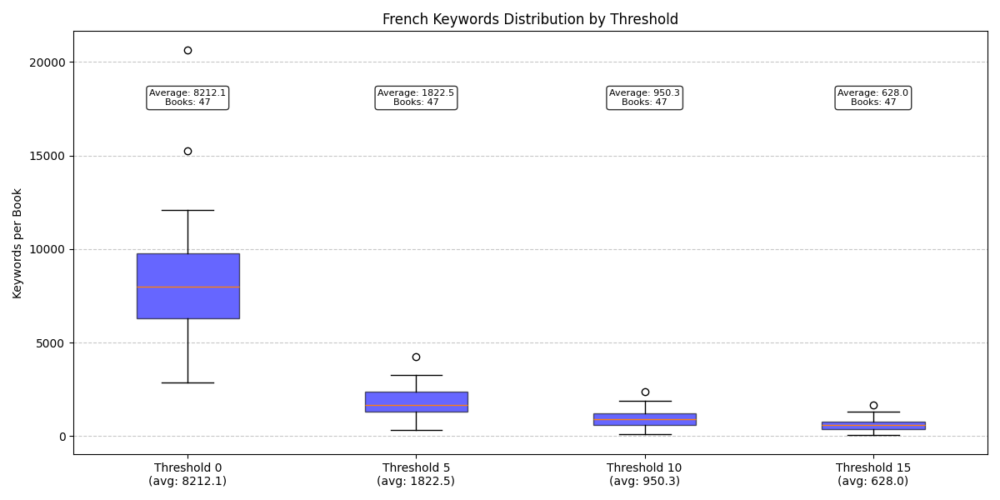

# Moteur de recherche de livre GUTENBERG
- Salim Tabellout
- Yanis Tabellout
# 1. Installation

### 1.1. Windows
Place yourself in the backend folder
```bash   
python -m venv env
./env/Scripts/activate
pip install -r req.txt
```
### 1.2. Macos/Linux
Place yourself in the backend folder
``` bash   
python3.11 -m venv env
source ./env/bin/activate
pip install -r req.txt
```
Postgres should be installed in your device.

``` bash   
brew install postgresql

```
The python version should be `< 3.12` && `>3.6`

## 2. Backend
File structure
 ```
 -> backend
    -> backend
    -> books 
    -> data
    -> keywords
    
```
Note that the books / keywords are in the gitignore files, what's more important is the db.sqlite3 since it has all of the data of the books.
### 2.0. First steps
- In case of using your own data (books) or your own database, please use these commands as well to `2.1.` section, if you decide to stick with the normal data, skip to section `2.2`.

in the backend folder
```bash   
python manage.py makemigrations
python manage.py migrate
```
### 2.1. Commands to execute
These django commands needs to be executed in this specific order so that the project actually works correctly, note that these commands may take some time, depending on your CPU / internet speed so grab a coffee and call your friends ( you probably don't have any since you're in computer science).
- Make sure to be in thed ```./backend``` folder
```sh   
mkdir keywords
python manage.py initBooks  
python manage.py computeKeywords
python manage.py addKeywords
python manage.py createGraphJaccard
python manage.py tfidf
python manage.py cosin keyword [args**]
```
### 2.2. Workflow of `./backend/data`
The `./backend/data` directory contains all the logic related to data processing, keyword computation, and similarity graph creation.
#### 2.2.1. `Commands`
 - ***Disclaimer*** : it's cruicial that  these commands are executed in order, one after the other
##### 2.2.1.1. `initBooks`
* Fetches book data from the Gutendex API `https://gutendex.com/books/` using `5000` Threads.
* we also make sure to only add french and english books.
* Extracts metadata such as title, author, language, and subjects, and the link to the book  eg(`https://www.gutenberg.org/cache/epub/26184/pg26184.txt`).
* Stores the data of the books in the database.
* *** Stores The book in the *** ```./backend/books```, folder with the format ```gutenberg_book_id.txt``` eg `1.txt` for each file, this approach helps simplify the calculations for the keywords, creation of neighbhoor from the jaccard distance, and makes sure that the database is filled only the with relevant information to the book but not the book itself.


##### 2.2.1.2. `computeKeywords`

-   Processes keywords from the `./backend/books` directory.
-   Normalizes text (lowercasing, removing stopwords, stemming) using the `spacy` package.
-  calculates each keyword's count in the file using the `Counter` package.
-   Computes the final keyword list, each keyword is mapped with its occurence, and the result is a json file stored `./backend/keywords`, an example of the file would be:
     ```
        {
           keyword_1: 12,
           keyword_2: 1 , 
           ...
        }
    ```

in a summary :
-   Ensures each book has a JSON file by:
    -   Loading language-specific NLP models (English and French).
    -   Extracting text from book files stored in the `books` directory.
    -   Processing each book's text with the appropriate language model.
    -   Applying lemmatization and filtering to extract meaningful keywords.
    -   Counting keyword occurrences and storing them in JSON format.
    -   Saving the keyword data to the `keywords` directory using the book's ID as the filename.

##### 2.2.1.3. `addKeywords`

- Reads pre-extracted keyword JSON files from the `keywords` directory.
- Each filename corresponds to a book's primary key (e.g., `123.json`).
- Each file contains a JSON dictionary mapping keywords to their occurrence counts.


1.  **Initialization:**
    -   Initializes dictionaries to track keywords and their language associations (English and French).
    -   Each language will have its own keywords, eg( data_keywordsenglish), so each keyword is unique. 

2.  **File Iteration:**
    -   Iterates through each keyword file in the `keywords` directory.
    -   For each file:
        -   **Book ID Extraction:** Extracts the book ID from the filename eg : `123.json`.
        -   **JSON Data Loading:** Loads the keyword data from the JSON file with its occurences.
        -   **Book Retrieval:** Retrieves the corresponding book object from the database.
        -   **Language Categorization:** Categorizes keywords by language (English or French), each language has its own correspondance table (eg : `keywordbook${language}`), the point is is mapping each keyword from a specific book, with its occurence.
        -   **Keyword Mapping:** Maps each keyword to book/occurrence pairs, so the table would be (id,occurence,book_id,keyword_id).

##### Database Operations


    -   For all  distinct ${Language} keywords:
        -   Creates `Keywords${Language}` objects.
        -   Creates `KeywordBook${Language}` relationship objects connecting:
            -   Books
            -   Occurrence counts
            -   Keywords
          
        -  Now each keyword has its unique id.
at the index : 
 - An index table is created mapping each keyword id, to its book id, and with its occurence, the index table is created for each language eg `keywordbook_${language}`

##### Problem

- After multiple attempts, we observed that standard preprocessing resulted in approximately 10 million tokens for English and 400k tokens for French. However, after 8 hours of continuous processing, we were only able to handle 250,000 English out of 10 million tokens. Additionally, the generated index table contained around 1 million rows, necessitating the implementation of a thresholding mechanism for each book.


# Keyword Analysis Results
<div align="center">
  
</div>

## English Keywords Analysis

<table>
  <tr>
    <td></td>
    <td></td>
  </tr>
  <tr>
    <td></td>
    <td></td>
  </tr>
</table>

## French Keywords Analysis

<table>
  <tr>
    <td></td>
    <td></td>
  </tr>
  <tr>
    <td></td>
    <td></td>
  </tr>
</table>

## Combined Analysis


- From the plots, we can see that just threshold of 5 is already making a 74-77% reduction, but we still are about 2.6 million tokens, so we decided to choose the ***25 threshold*** for english to get about 580k tokens, and ***10*** for french to 40k tokens.
- Further analysis revealed that the primary bottleneck was caused by low-frequency tokens, specifically those that appeared only once in the dataset (eg: `'hello'` appears once in Books ``1..1664``). To optimize performance, we introduced a filtering criterion: tokens with an occurrence below a predefined threshold were excluded from the index table. This pre-filtering step significantly reduced the number of candidate tokens, bringing the English token count from 10 million to 36,000 and the French token count from 400k to 44k. This bottleneck was because of the slow r/w queries to the database. 


##### 2.2.1.4. `createGraphJaccard`

-   Computes Jaccard similarity between books based on their keywords.
-   Creates a graph where books with similarity above a threshold (0.5) are linked.
-   Stores neighbor relationships in the `Neighbors` model:
    -   Loads all keyword JSON files from the `keywords` directory.
    -   Creates a dictionary mapping book IDs to their keyword occurrences.
    -   Compares each book with all other books using the Jaccard distance function.
    -   When the distance is below the threshold (indicating similarity), connects books as neighbors.
    -   Creates bi-directional neighbor relationships in the database.
##### 2.2.1.5. `tfidf`
- creates the TF-IDF for each keyword 
##### 2.2.1.5. `cosin`
- This script serves as a local test for improving book search speed using cosine similarity
1. **Command-Line Arguments**:
   - `keyword` (str): The keyword to search for (e.g., "sargon").
   - `--language` (str): Language selection (`english`, `french`, or `both`).
   - `--top` (int): Number of top similar books to return (default: 10).
   - `--min-score` (float): Minimum similarity threshold (default: 0.4)
2. **Search Process**:
   - Finds matching keywords in `KeywordsEnglish` and `KeywordsFrench` models.
   - Retrieves books linked to these keywords from `Book` via `KeywordBookEnglish` or `KeywordBookFrench`.
   - Groups books by keyword and displays search results.
3. **Output & Performance**:
   - Displays found keywords and the number of books associated with each.
   - Shows up to 5 books per keyword, with an indicator if more exist.
   - Measures and prints execution time for performance comparison.

##### 2.2.1.7 `Number of tokens, Index Table size `
 - English 
    - number of unique tokens : 36k 
    - index table size : 580k rows
 - French 
    - number of unique tokens  : 6.5k 
    - index table size : 40k rows
 - Graph :
    - Number of vertices : 1099 vertices (rows)
    - number of bi-directional edges : 42956 edges (rows) 
    - number of edges : 21478 edges
## Calculation of the Average Number of Neighbors per Vertex

### Data:
- **Number of vertices**: \( n = 1099 \)
- **Total number of edges**: \( E = 21478 \)

### Calculation of the Average Degree:
since $\sum_{u \in V}deg(v) = 2 \times |E|$ then, 

The formula for the average degree ($ d_{\text{avg}} $) is given by:

$
d_{\text{avg}} = \frac{2 \times E}{n} $  

Substituting the values:

$
d_{\text{avg}} = \frac{2 \times 21478}{1099}
$

$
d_{\text{avg}} \approx \frac{42956}{1099} \approx 39.08
$

Thus, on average, **each vertex is connected to approximately 39 other vertices**.


## Theoretical Maximum Number of Edges

The **maximum number of edges** in a simple graph (without loops or multiple edges) is given by the formula:

$
E_{\text{max}} = \frac{n(n-1)}{2}
$

Substituting \( n = 1099 \):

$
E_{\text{max}} = \frac{1099 \times 1098}{2}
$

$
E_{\text{max}} = \frac{1206702}{2} = 603351
$
Therefore, **the maximum possible number of edges in this graph is 603,351**.
 

#### 2.2.2. Jaccard Similarity

-   The Jaccard similarity coefficient is used to determine the similarity between two sets of keywords:
    -   `J(A, B) = |A ∩ B| / |A ∪ B|`
    -   Where:
        -   `A` and `B` are the sets of keywords for two books.
        -   `|A ∩ B|` is the number of common keywords.
        -   `|A ∪ B|` is the total number of unique keywords in both books.
-   A Jaccard score above 0.4 indicates that two books are sufficiently similar to be considered neighbors.
-   Our implementation:
    -   Calculates the difference between keyword occurrence counts.
    -   Divides by the maximum possible difference.
    -   Returns distance (lower values indicate greater similarity).
    -   Uses a threshold of 0.6 for distance.

#### 2.2.3. Serialization (`serializers.py`)

-   Converts Django model instances into JSON format for API responses.
-   Serializes books, their metadata, and neighbor relationships:
    -   `LanguageSerializer`: Exposes language code.
    -   `PersonSerializer`: Includes author name, birth, and death years.
    -   `SubjectSerializer`: Provides subject names.
    -   `BookSerializer`: Comprehensive book data including authors, languages, and subjects.

#### 2.2.4. Configuration (`config.py`)

-   Contains global settings like threshold values for Jaccard similarity.
-   Defines paths for keyword storage.

#### 2.2.5. Views (`views.py`)

-   Handles API endpoints:
    -   `server/books/`: Returns the list of books with filtering options:
        -   Language filtering.
        -   Author name search (classic or regex).
        -   Title search (classic or regex).
        -   Keyword search with language specification.
        -   Download count sorting.
    -   `data/books/neighbors/<int:pk>`: Returns neighbors of a given book, using either betweeness or closeness centrality  :
        -   Retrieves neighbor relationships from the database.
        -   applies the centrality method.
        -   Returns detailed book information for all neighbors.
        
    -   `data/books/keywords/cosine-similarity/` : returns neighbhors using cosine similarity for keywords.
 
#### 2.2.6. `sort.py`: Sorting and Suggestion Logic

-   **Purpose:** Implements sorting based on graph centrality and generates book suggestions.
-   **Workflow:**
    1.  **Suggestions:**
        -   Checks cache for existing suggestion results.
        -   Processes only the first 2 books from the list.
        -   Retrieves neighbor books from the `/data/books/neighbors/` API.
        -   Uses per-book caching to optimize network requests.
        -   Implements request timeout to prevent performance bottlenecks.
        -   Returns a list of unique suggested books (up to 10).
    2.  **Sorting by Centrality:**
        -   Checks cache for existing centrality calculations.
        -   Constructs a graph (weighted or unweighted) based on book subject similarities.
        -   Calculates centrality measures using standard or simplified algorithms.
        -   Sorts books based on their calculated centrality scores.
        -   Caches results for 24 hours.
        -   Returns the sorted list of books
   
-   **Graph Representation:**
    -   Books are represented as nodes in the graph.
    -   Edges between nodes represent similarity between books.
    -   **Node Weight:** In a weighted graph, the weight of an edge represents the degree of similarity between two books, calculated by the number of shared subjects.
    -   **Adding Neighbors:** Neighbors are added based on the intersection of the subject lists of the books. If the intersection is not empty, an edge is created between the corresponding nodes.
#### 2.2.7. `graph.py`: Graph Data Structures and Algorithms

-   **Purpose:** Implements graph data structures and centrality algorithms.
-   **Graph Representation:**
    -   Uses `Node` classes to represent books, storing book data and centrality scores.
    -   `UnweightedGraph` and `WeightedGraph` classes provide graph implementations.
    -   Edges are stored as neighbor relationships within the nodes.
-   **Centrality Algorithms:**
    -   Implements Brandes' algorithm for calculating betweenness centrality in unweighted graphs.
-   **Adding Neighbors:**
    -   `UnweightedGraph`: Adds neighbor nodes to a node's neighbor list.
    -   `WeightedGraph`: Adds neighbor nodes with their corresponding edge weights to a node's neighbor dictionary.
#### 2.2.8. `centrality.py`: Centrality Calculation

-   **Purpose:** Implements algorithms for calculating closeness and betweenness centrality.
-   **Closeness Centrality:**
        - For nodes with many connections, approximates using top 20 closest connections.
        - Scales distance proportionally to account for missing connections.
        - The closeness centrality is inversely proportional to the sum of these weights.
-   **Betweenness Centrality:**
    - For large graphs, processes only top 30 most connected nodes.
    - For nodes with many neighbors, limits processing to top 20 neighbors.
    - Implements timeout control (2 seconds) to prevent excessive calculation time.
    - Uses Brandes' algorithm with optimizations for efficient calculation.
-   **Functionality:**
    -   Provides functions to compute both closeness and betweenness centrality measures.
    -   Uses graph data structures from `graph.py`.
#### `Caching strategy` 
- Implemented multi-level caching for different parts of the application
- Cached API responses, neighbors data, and centrality calculations
- Used unique cache keys based on query parameters
- Added reasonable timeouts for cached items


## 2.3. Results :
- Here we tried comparing The betweeness & closness & cosin. Our method is simple, Cosin takes in precalculated tf-idf for each token, and returns the books candidates. For the centrality, upon the request, we get the neighbhors that are precalculated and are in the data base, and we get the nodes to process, we may note that the graph can either be weighted  or UnweightedGraph, the closeness centrality, the graph needs to be weighted, but the betweenesss is an UnweightedGraph. We also sort by the number of download. the query is tested on the same token that is `sargon` for closeness and for for the between the title "The c" was selected
   -  ***Results of calculation time***
        - 1. ***Cosin*** : 0.00155 ~0.0017 seconds 
        - 2. ***Closeness*** : 0.005
        - 3. ***Betweeness*** : 0.0067
        - 4. ***Download count*** : 0.014 3seconds 

    which makes the cosin the fastest of them.
## 2.4. Compraison on api requests: 
The point is to get the books that the world `hello` appears, the aim is trying to calculate the request time of each method. The calculation time starts from the moment the request is receive until the reponse is sent.
  -  ***Results of api requests***
    - 1. ***Cosin*** : 0.04 seconds
    - 2. ***Closeness*** : 1.32 seconds
    - 3. ***Betweeness*** : 1.44 seconds
    - 4. ***Download count*** : 1.5 seconds 

## 3. Server Startup
in the ```./backend``` folder, execute :
```bash
python manage.py runserver
```
default host is ```localhost:8000``` 

## 4. Frontend startup

``` bash
cd frontend
npm i 
npm run dev
```
default host is ```localhost:3000``` 

